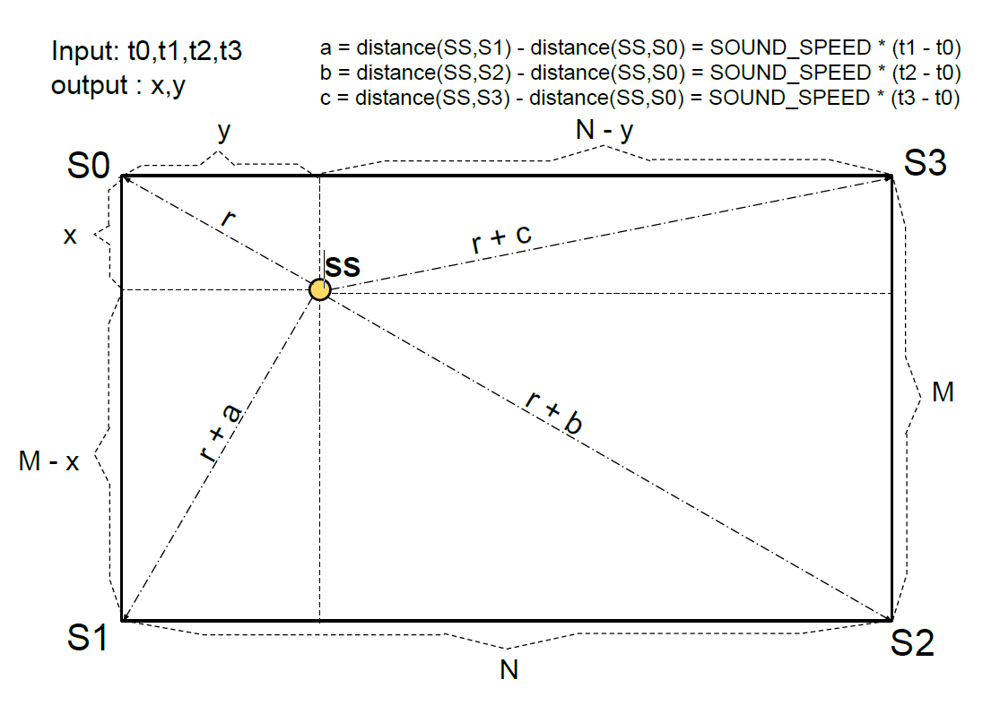
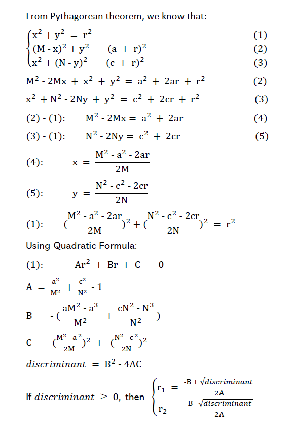

# Algorithm

This algorithm is designed to solve for the position of the sound source on a rectangular board, given times of sound arrival at each corner microphone sensor. The board can be of any dimension as long as it is rectangular. This algorithm is proved to be 100% accurate in theory.

The design and implementation of the algorithm is described below.

Here is the [link](https://www.bilibili.com/video/av93537160) for a detailed explanation video.

